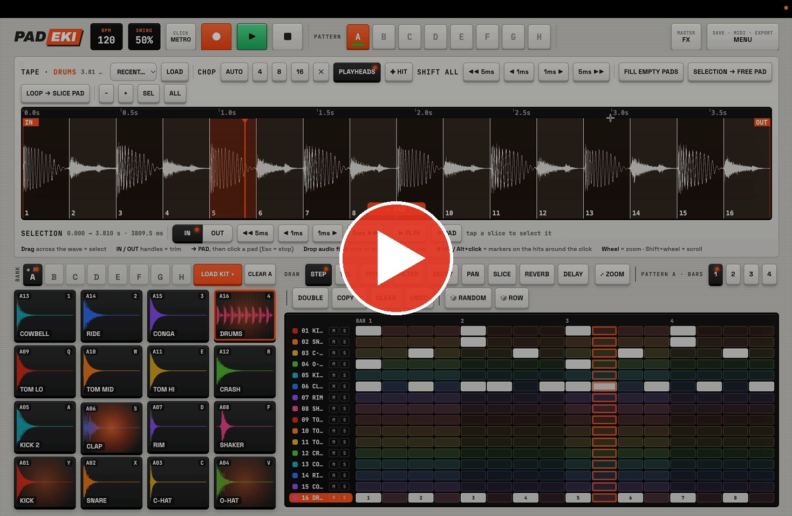
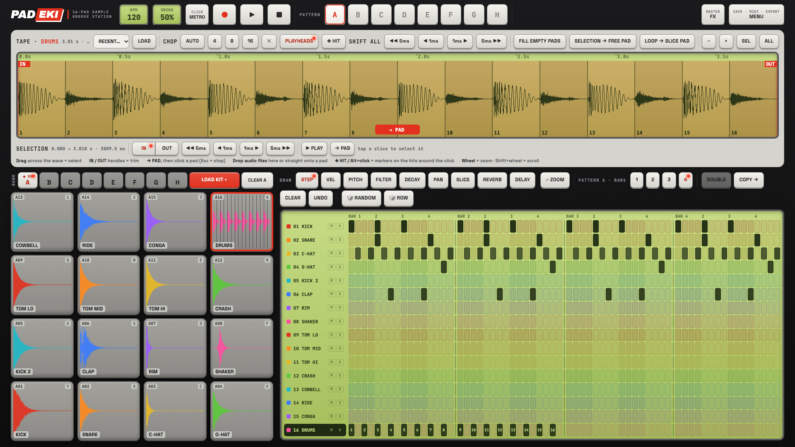
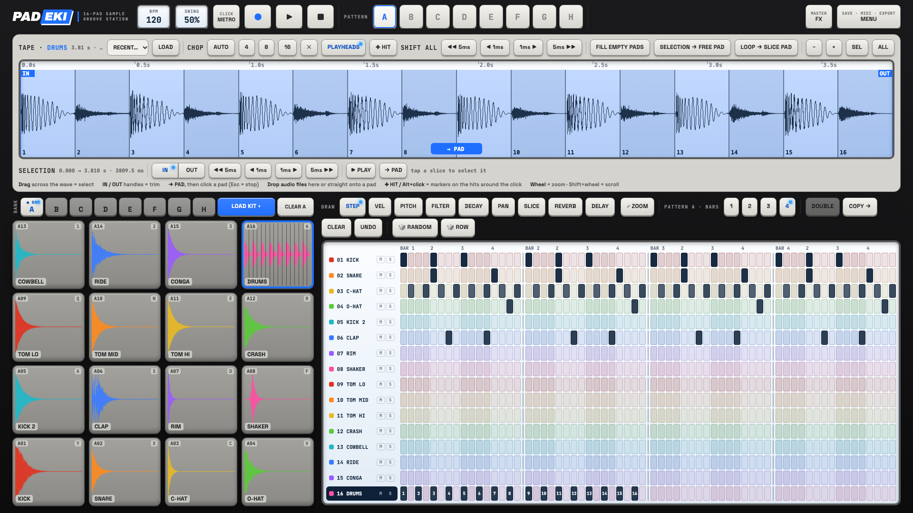
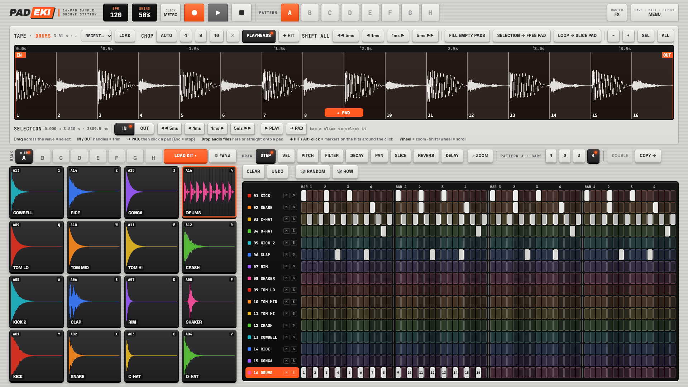
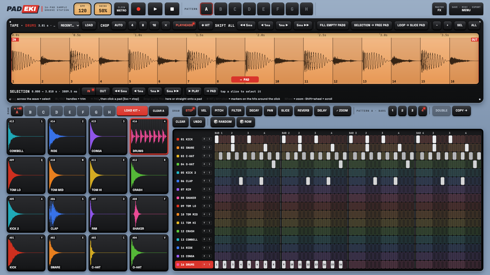

# PADEKI – 16 pados sample groove station

[🇬🇧 English](README.md) · 🇭🇺 Magyar

**▶ Kipróbálható online:** [ekidio.github.io/padeki](https://ekidio.github.io/padeki/)

**[▶ Demóvideó](https://ekidio.github.io/padeki/media/padeki-demo.mp4)** · 39 mp, hanggal

A **PADEKI** egyetlen HTML fájlból álló, böngészőben futó padsampler és step sequencer, a klasszikus MPC-szerű groove-boxok szellemében. Betöltesz egy loopot a TAPE-re, felszeleteled, a szeleteket padokra teszed, és beprogramozod a ritmust. Egérrel, a számítógép billentyűzetével vagy USB-s MIDI pad kontrollerrel is játszhatsz rajta.

Vanilla JavaScriptben, Web Audio API-val készült. Nincs telepítés, nincs build, nincs szerver. Minden a böngésződben fut, a hanganyag nem hagyja el a gépedet.

A PADEKI a DAWEKI család tagja ([DAWEKI V3](https://github.com/Ekidio/daweki_v3)).

## Funkciók

### TAPE: a mintaszerkesztő
- Húzz egy hangfájlt a TAPE-re (vagy **LOAD**). Görgővel nagyítasz, a kijelölést az **IN / OUT** fogantyúkkal állítod.
- **CHOP**: az **AUTO** minden tranziensnél markert tesz, vagy vágd **4 / 8 / 16** egyenlő szeletre.
- A **+HIT / Alt+kattintás** a kattintás körüli ütésekre tesz markert. Mintapontos vágáshoz ott a **SHIFT ALL** és az **IN / OUT ±1 / 5 ms**.
- **→ PAD**: kattints egy szeletre, aztán egy padra. Vagy használd a **FILL EMPTY PADS** és a **SELECTION → FREE PAD** gombot.
- **LOOP → SLICE PAD** (ReCycle / REX elv): az egész loop a szeleteivel együtt **egyetlen padra** kerül. A pad sora a szeleteket az eredeti helyükön játssza. A loop bármilyen tempót követ, a hangmagassága nem változik.

### PADOK
- **8 bank (A–H) × 16 pad**, mindegyiken a saját hullámformájával. **LOAD KIT** a beépített kitekhez, **CLEAR** a bank kiürítéséhez.
- **PAD EDITOR** (hosszú nyomás vagy jobb klikk a padon):
  - TUNE, DECAY, FILTER, LOW CUT, DRIVE, VOLUME, PAN, REVERB és DELAY
  - REVERSE és CHOKE csoportok
  - COPY / PASTE és átnevezés
- **KEYS ♪**: egy hangot kromatikusan játszhatsz.
  - Alaphang-felismerés cent pontosságú finomhangolással.
  - Középre igazított 16 hangos tartomány.
  - Zongora-kiosztás a laptop billentyűzetén: `A W S E D F T G Z H U J K`, oktáv le / fel: `Y` / `X`.
- **Beépített kitek**, mind kódból generálva, mind zengetés nélkül:
  - Elektronikus: EK-808, EK-909, DUSTY LO-FI, TRAP
  - Akusztikus: FUNKY, ROCK, HEAVY, JAZZ

### Sequencer
- 8 pattern (**A–H**), mindegyik 1–4 ütem, ütemenként 16 lépéssel. Láncolás **Shift + kattintással**.
- **DRAW** sávok a hangonkénti értékekhez: STEP, VEL, PITCH, FILTER, DECAY, PAN, SLICE, REVERB és DELAY.
- A **⤢ ZOOM** a kijelölt sort pad-magasra nagyítja, a **↑ / ↓** a sorok között léptet.
- **M / S** (némítás / szóló) minden soron. A **🎲 RANDOM** új ritmust ír a bankra, a **🎲 ROW** csak egy sorra (slice padon a szeleteket keveri).
- **DOUBLE**, **COPY →**, **CLEAR** és **UNDO**.
- Swing, metronóm, előszámlálás és élő felvétel a padokról, a billentyűzetről vagy MIDI-ről.

### Keverés, export, projektek
- **MASTER FX**: reverb és tempóra szinkronizált delay küldés, master hangerő és limiter.
- Az **EXPORT WAV** a pattern-láncot ×1 / ×2 / ×4 / ×8 hosszban menti, kétféle módban:
  - **LOOP**: pontos hossz, a lecsengés az elejére kerül, így a fájl hézag nélkül loopol.
  - **+ TAIL**: a végén kicsenghet a hang.
- **SAVE / OPEN**: `.padeki` projektfájl, a mintákkal együtt. Az előző munkamenet is megmarad: **MENU → LAST SESSION**.
- **Web MIDI bemenet** 16 pados kontrollerekhez (36–51-es hangok → 1–16. pad), plusz MIDI start / stop.

### Négy skin
**MENU → LOOK & CLICK**: CLASSIC, ICE, MODERN, ANALOG.

| CLASSIC | ICE |
|---|---|
|  |  |
| **MODERN** | **ANALOG** |
|  |  |

## Gyors kezdés
1. Nyisd meg a [webes alkalmazást](https://ekidio.github.io/padeki/), vagy töltsd le az `index.html` fájlt, és nyisd meg a böngészőben.
2. Kattints a villogó **LOAD KIT ▾** gombra, és válassz egy kitet. Vagy húzd rá a saját loopodat a TAPE-re.
3. Kattintgass a grid celláira, aztán **▶** vagy **Szóköz**.
4. Húzz egy dob-loopot a TAPE-re, majd **AUTO**, aztán **LOOP → SLICE PAD**. A loopod ezután a projekt tempóját követi.
5. Ha kész vagy: **MENU → EXPORT WAV** vagy **SAVE**.

## Billentyűzet
| Billentyű | Funkció |
|---|---|
| `Szóköz` | Lejátszás / stop |
| `1 2 3 4` · `Q W E R` · `A S D F` · `Y X C V` | 13–16. · 9–12. · 5–8. · 1–4. pad |
| `↑ / ↓` | Előző / következő sor a gridben |
| `← / →` (Shift = 5 ms) | A kijelölt szeletél igazítása a TAPE-en |
| `Esc` | A szeletek padra küldésének leállítása |

A billentyűk fizikai hely szerint működnek, így magyar (QWERTZ) és angol (QWERTY) kiosztással is jók.

## Böngésző
Friss **Chrome** vagy **Edge** (ajánlott, a Web MIDI-hez szükséges), vagy Safari / Firefox. A felület 1280–1920 px széles asztali képernyőre készült.

## Licenc
© Ekidio. Minden jog fenntartva, ha másképp nincs jelölve.
